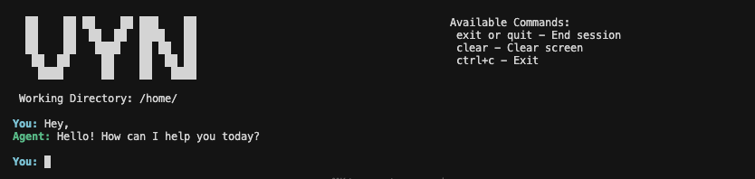

# VYN - AI Coding Agent

VYN is an interactive CLI assistant powered by OpenAI's GPT-4.1-mini that helps you manage files, directories, and execute commands using natural language. Think of it as Claude Code for your terminal.

## Features

- **Natural Language Interface**: Conversational AI that understands your commands
- **File Operations**: Read, write, edit, delete, rename, move, and search files
- **Directory Management**: List files, create directories, view directory trees
- **Code Operations**: Index codebase files, get context from specific line ranges
- **Command Execution**: Run shell commands directly
- **Text Search**: Search text in directories using grep or search the internet
- **Context Aware**: Understands relative paths, "here", and "current directory"
- **Multi-step Planning**: Automatically breaks down complex tasks into actionable steps

## Directory Structure

```
vyn/
├── vyn_cli.py              # Main CLI entry point
├── vyn_banner.png          # Banner image
├── requirements.txt        # Python dependencies
├── README.md               # This file
└── src/
    ├── agent/
    │   └── core.py         # Agent class with OpenAI integration and conversation loop
    └── tools/
        ├── tool_definition.py  # Tool schemas for OpenAI function calling
        └── tool_ops.py         # Tool implementations (file ops, commands, etc.)
```

## Installation

### Prerequisites

- Python 3.7 or higher
- OpenAI API key 

### Setup

1. **Install dependencies:**
   ```bash
   cd vyn
   pip install -r requirements.txt
   ```

2. **Set up your OpenAI API key:**
   
   For current session only:
   ```bash
   export OPENAI_API_KEY='your-api-key-here'
   ```

## Usage

### Running VYN

**Create an alias (recommended):**
Add this to your `~/.bashrc` or `~/.zshrc`:
```bash
alias vyn="python .../vyn/vyn_cli.py"
```

Then reload your shell:
```bash
source ~/.bashrc
```

Now launch VYN from anywhere:
```bash
vyn
```

**Warning**
It takes a couple of seconds to load after you type the first command.

**Direct execution:**
```bash
python .../vyn/vyn_cli.py
```

### CLI Commands

While in the interactive session:
- `exit` or `quit` - Exit the application
- `clear` - Clear the screen
- `Ctrl+C` - Force exit

## Available Tools

VYN provides the following tools to the AI agent:

| Tool | Description |
|------|-------------|
| `read_file` | Reads and displays file contents |
| `edit_file` | Creates or modifies file contents |
| `delete_file` | Deletes a file |
| `list_files` | Lists files in a directory |
| `search_file` | Checks if a file exists |
| `rename_file` | Renames a file |
| `move_file` | Moves a file to a new location |
| `make_directory` | Creates a new directory |
| `list_directory_tree` | Shows recursive directory structure |
| `read_file_content` | Reads file content (raw) |
| `grep_text` | Searches for text in files within a directory |
| `search_text_by_browser` | Searches the internet for text |
| `run_command` | Executes shell commands |
| `index_codebase` | Creates embeddings for codebase files |
| `get_context_from_file` | Extracts specific line ranges from files |

## Architecture

### Core Components

- **`vyn_cli.py`**: Handles user interaction, banner display, and session management
- **`src/agent/core.py`**: Contains the `Agent` class that:
  - Manages conversation history
  - Calls OpenAI API with tool definitions
  - Executes tools and processes results
  - Handles multi-step workflows
- **`src/tools/tool_definition.py`**: Defines tool schemas in OpenAI function calling format
- **`src/tools/tool_ops.py`**: Implements all tool functions and the `call_tool` dispatcher


## Technical Details

- **Model**: GPT-4.1-mini (via OpenAI Responses API)
- **Framework**: OpenAI Python SDK
- **Tool Calling**: Function calling with JSON schemas
- **Error Handling**: Comprehensive try-catch blocks with user-friendly messages
- **Session Management**: In-memory conversation history for context


## Tips

- **Be specific**: Use clear file paths when working outside the current directory
- **Natural language**: The AI understands context, so speak naturally
- **Multi-step tasks**: VYN can handle complex requests that require multiple operations
- **Conversation context**: The agent remembers previous messages in the session
- **Path flexibility**: Use relative paths (like `./file.txt`) or absolute paths (`/full/path/file.txt`)

## Requirements

- `openai>=1.0.0`
- Optional: `requests` and `beautifulsoup4` (for internet search functionality)

## License

This project is for educational and personal use.

## Contributing

Potential extensions:
- More file operations (copy, symlink)
- Git operations integration
- Multi-file batch operations
- Syntax highlighting in file previews
- Configuration file support
- Plugin system for custom tools
